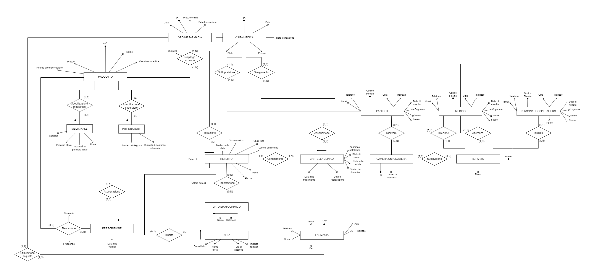

# GeriatricHospitalDB

A relational database designed for managing key aspects of a geriatric hospital, including patient records, medical staff, appointments, and treatment plans.

## Features

- Comprehensive structure to support the operations of a geriatric hospital.
- Focus on managing patients, medical staff, appointments, treatments, and more.

## Database Overview

The following Entity-Relationship (E-R) diagram illustrates the structure of the database, showing the relationships between key entities such as patients, medical staff, hospital rooms, and treatments.

### Diagram Description
- **Patient**: Stores personal information and medical history.
- **Medical Staff**: Includes doctors and hospital personnel responsible for patient care.
- **Hospital Room**: Manages patient accommodations and assignments.
- **Medical Visits & Appointments**: Tracks scheduled consultations and examinations.
- **Prescriptions & Pharmacy Orders**: Handles medication prescriptions and transactions with the pharmacy.
- **Medical Records**: Stores reports, laboratory test results, and treatment plans.

This structured approach ensures efficient hospital management by maintaining clear relationships between entities.

## Usage

1. Import the SQL file into your preferred database management system (e.g., MySQL).
2. Customize the schema to meet the specific requirements of your hospital project.
3. Integrate it with your application's backend to leverage its functionality.

## License

This project is shared for academic purposes. Please ensure proper attribution if used in other projects.
